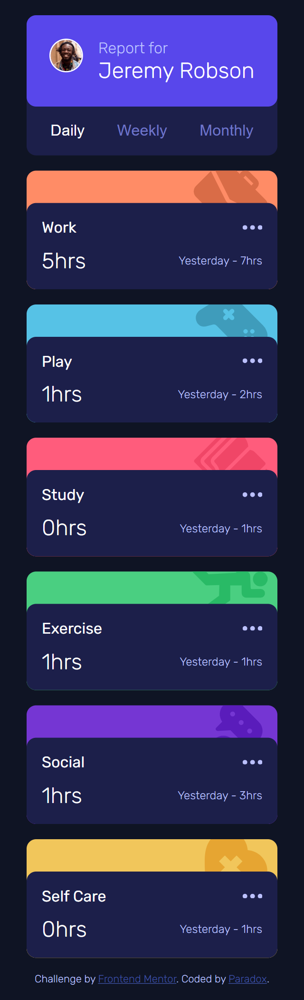
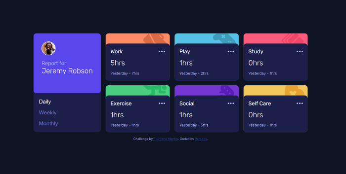

# Frontend Mentor - Time tracking dashboard solution

This is a solution to the [Time tracking dashboard challenge on Frontend Mentor](https://www.frontendmentor.io/challenges/time-tracking-dashboard-UIQ7167Jw). Frontend Mentor challenges help you improve your coding skills by building realistic projects. 

## Table of contents

- [Overview](#overview)
  - [The challenge](#the-challenge)
  - [Screenshot](#screenshot)
  - [Links](#links)
- [My process](#my-process)
  - [Built with](#built-with)
  - [What I learned](#what-i-learned)
  - [Continued development](#continued-development)
  - [Useful resources](#useful-resources)
- [Author](#author)
- [Acknowledgments](#acknowledgments)

## Overview

### The challenge

Users should be able to:

- View the optimal layout for the site depending on their device's screen size
- See hover states for all interactive elements on the page
- Switch between viewing Daily, Weekly, and Monthly stats

### Screenshot






### Links

- Solution URL: [Solution URL](https://github.com/Taresta/time-tracking-dashboard-main.git)
- Live Site URL: [Lve Site URL](https://taresta.github.io/time-tracking-dashboard-main/)

## My process

### Built with

- Semantic HTML5 markup
- SCSS custom properties
- Flexbox
- CSS Grid
- Mobile-first workflow


### What I learned
Well, apart from the learning various lessons about how I can build a page using data.json, one of the most important things that I have learnt in this challenge or my previous ones is to embrace the problems. The errors and the uncertainity about how to do things offer you great insights when you finally learn the answer.

Ok, here we go
1. The first lesson would definitely be how to work with promises and async function to fetch data. Although, I have not become proficient yet, well it is a good start.
2. When you get stuck at doing something, try to see if you can break the problem into smaller chunks. It is okay to come with multiple plans, deploy them, cross out the ones that do not work and ultimately you will find the one you have been looking for. Remember how you struggled to design the hover states for the buttons. Tried out various solutions and the answer was to simply create another function and write our spells(code) in it.
3. I also had trouble in rendering the correct data, when a certain button is clicked. After trying out various methods, the one that worked was passing a second argument to the populateDOM function that would store the option for the timeframe selected by the user:
```jss
function populateDOM(activityData, timeframe = "daily") {}
```
4. I also was confused about how to add svgs in my activityContainer because I was creating rest of the DOM using data.json file and svgs were not part of it. I did a bit of search on MDN and insertAdjacentHTML came really handy here.
```jss
activityContainer.insertAdjacentHTML(
                'afterbegin', 
                '<svg></svg>'
            );
```
5. There is one more thing. I had first declared the data as a local variable inside the async function and after that I needed to call the populateDOM function from the handleView event handler. However, the problem was how to pass in the data argument when I can only access it locally inside the async fetchData function. I know the solution sounds very simple, but I did struggle a bit at this point whether to make data global variable or not.
This is because the data was being returned as a promise by the asunc function, so I was not sure if I could access it as a regular variable from somewhere else. However, now I know that I can.
To see how you can add code snippets, see below:


### Continued development

Continue to work with aynchronous javascript. I have just barely touched the surface with this project and I know that there is still a lot to learn about this topic.

### Useful resources

- [MDN Documentation](https://developer.mozilla.org/en-US/) - I do not remember how many times, I have accessed it when I am stuck, needed a bit of help or just forgot how to write a certain snippet of code. This is always the best reference guide.
- [FrontEnd Mentor- Working With Data](https://www.frontendmentor.io/learning-paths/javascript-fundamentals-oR7g6-mTZ-/steps/66d537703c19191dc3bc0d34/article/read) - This is an amazing article helped me understand the basics of working with data in javascript.

## Author

- Website - [Taresta](https://github.com/Taresta)
- Frontend Mentor - [Paradox](https://www.frontendmentor.io/profile/Taresta)


## Acknowledgments
Thanks to all the useful resources out there and thanks to the friend who always motivates me to keep on improving a little every day.
